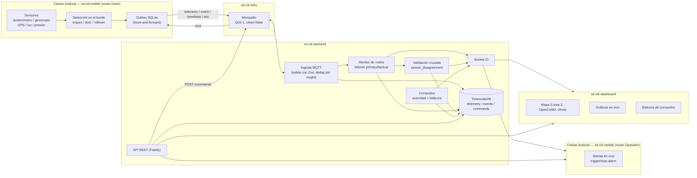

# Arquitectura SIT-CIIT

## Vista general

## Por qué esta forma

- **El nodo nunca depende de la nube para detectar eventos**: el borde
  (celular) decide `impact`/`door_open`/`rollover` localmente con los
  umbrales configurados, y el outbox garantiza que el evento no se pierde
  aunque no haya señal. Esto es lo que permite operar en el Istmo, donde
  hay tramos sin cobertura celular.
- **Mosquitto con `clean: false` y QoS 1** hace que el broker retenga
  comandos pendientes para un nodo desconectado — el comando se entrega en
  cuanto el nodo reconecta, sin que el backend tenga que reintentarlo.
- **El backend es hexagonal** (dominio/aplicación separados de los
  adaptadores MQTT/HTTP/Postgres) para poder, en el futuro, sustituir el
  nodo celular por un ESP32 hablando el mismo contrato MQTT sin tocar el
  dominio.
- **TimescaleDB** porque `telemetry` es una serie de tiempo de alto volumen
  (hasta 1 muestra/segundo por nodo); una hypertable evita tener que
  reinventar particionado por tiempo.

## Trazado real de la Línea Z

`sit-ciit-infra/data/linea-z.geojson`, descargado una sola vez desde OSM/
Overpass (`scripts/fetch-linea-z.ts`), se usa como capa estática en el
mapa del dashboard. No se regenera en cada demo.
